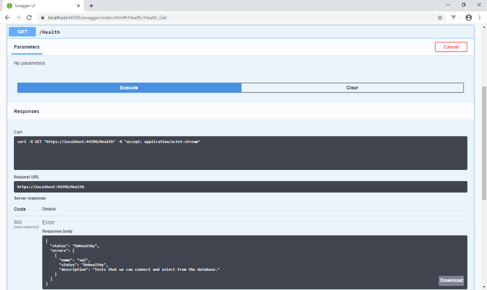

+++
date = "2020-06-10"
title = "How to add health checks to ASP.NET Core with Swagger support"
slug = "how-to-add-health-checks-asp-net-core-with-swagger-support"
tags = [
    ".NET","Swagger"
]
categories = [
    ".NET","Swagger"
]
+++

The code for this example can be found on [Github](https://github.com/codenesium/blog/tree/master/code/APIHealthChecks)

Health checks are a nice feature in ASP.NET Core that lets you create an endpoint that your load balancer or health checking systems can ping to check your service. If there is an unhealthy response then the response will have a 503 response code. Otherwise it will be 200. You can chain multiple health checks together to check the various resources your service depends on.

You may want to create different health checks for performance reasons. You may want a lightweight check that is
used to determine if your service is alive at all and a more heavyweight check that checks everything. 





Adding a health check is straight forward. You can check your database connection or perform any other operation you need.


```
public void ConfigureServices(IServiceCollection services)
{
    services.AddControllers();
    services.AddOpenApiDocument();

    string connectionString = this.Configuration.GetConnectionString("Default");

    services.AddHealthChecks().AddCheck("sql", () =>
    {
        string sqlHealthCheckDescription = "Tests that we can connect and select from the database.";
        using (SqlConnection connection = new SqlConnection(connectionString))
        {
            try
            {
                connection.Open();
                SqlCommand command = new SqlCommand("SELECT TOP(1) id from dbo.Pets", connection);
                command.ExecuteNonQuery();
            }
            catch (Exception ex)
            {
                Log.Error(ex, "Exception in sql health check");
                return HealthCheckResult.Unhealthy(sqlHealthCheckDescription);
            }
        }

        return HealthCheckResult.Healthy(sqlHealthCheckDescription);
    });
}
```

Normally you would also use endpoints.MapHealthChecks like this to enable your health checks. This does work but your health check won't show up in swagger.

```
 public void Configure(IApplicationBuilder app, IWebHostEnvironment env)
{
    if (env.IsDevelopment())
    {
        app.UseDeveloperExceptionPage();
    }

    app.UseHttpsRedirection();

    app.UseRouting();

    app.UseAuthorization();

    app.UseOpenApi();

    app.UseSwaggerUi3();

    app.UseEndpoints(endpoints =>
    {
        endpoints.MapControllers();
        endpoints.MapHealthChecks("/health")
    });
}
```

I prefer for my health checks to show up in swagger. You can accomplish this by adding a health controller.

```
using System.Collections.Generic;
using System.Linq;
using System.Net;
using System.Threading.Tasks;
using Microsoft.AspNetCore.Authorization;
using Microsoft.AspNetCore.Http;
using Microsoft.AspNetCore.Mvc;
using Microsoft.Extensions.Diagnostics.HealthChecks;

namespace APIHealthChecks.Controllers
{
    [Route("[controller]")]
    [ApiController]
    [AllowAnonymous]
    public class HealthController : ControllerBase
    {
        private readonly HealthCheckService healthCheckService;

        public HealthController(HealthCheckService healthCheckService)
        {
            this.healthCheckService = healthCheckService;
        }

        [HttpGet]
        public async Task<ActionResult> Get()
        {
            HealthReport report = await this.healthCheckService.CheckHealthAsync();
            var result = new
            {
                status = report.Status.ToString(),
                errors = report.Entries.Select(e => new { name = e.Key, status = e.Value.Status.ToString(), description = e.Value.Description.ToString() })
            };
            return report.Status == HealthStatus.Healthy ? this.Ok(result) : this.StatusCode((int)HttpStatusCode.ServiceUnavailable, result);
        }
    }
}
```