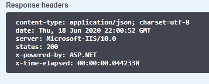

+++
date = "2020-06-18"
title = "How to benchmark API requests in ASP.NET Core"
slug = "how-to-benchmark-api-requests-in-asp-net-core"
tags = [
    ".NET"
]
categories = [
    ".NET",
]
+++


The code for this example can be found on [Github](https://github.com/codenesium/blog/code/tree/master/BenchmarkApiRequests)

It's helpful to see how long API requests are taking. In .NET core it's not difficult to add a middleware that will add
a response header to your response which tells you how long the request took on the server. We've added x-time-elapsed. 




### BenchmarkMiddleware.cs

```
using Microsoft.AspNetCore.Builder;
using Microsoft.AspNetCore.Http;
using Microsoft.AspNetCore.Mvc.Filters;
using System;
using System.Collections.Generic;
using System.Diagnostics;
using System.Linq;
using System.Threading.Tasks;

namespace BenchmarkApiRequests
{
    public class BenchmarkMiddleware
    {
        private readonly RequestDelegate next;

        public BenchmarkMiddleware(RequestDelegate next)
        {
            this.next = next;
        }

        public async Task InvokeAsync(HttpContext context)
        {
            Stopwatch stopwatch = Stopwatch.StartNew();
            context.Response.OnStarting(() =>
            {
                stopwatch.Stop();
                context.Response.Headers.Add("x-time-elapsed", stopwatch.Elapsed.ToString());
                return Task.CompletedTask;
            });
            await this.next(context);

        }
    }
    public static class BenchmarkMiddlewareExtensions
    {
        public static IApplicationBuilder UseBenchmarkMiddleware(
            this IApplicationBuilder builder)
        {
            return builder.UseMiddleware<BenchmarkMiddleware>();
        }
    }
}
```

### Startup.cs

```
public void Configure(IApplicationBuilder app, IWebHostEnvironment env)
{
    if (env.IsDevelopment())
    {
        app.UseDeveloperExceptionPage();
    }

    app.UseBenchmarkMiddleware();

...
```